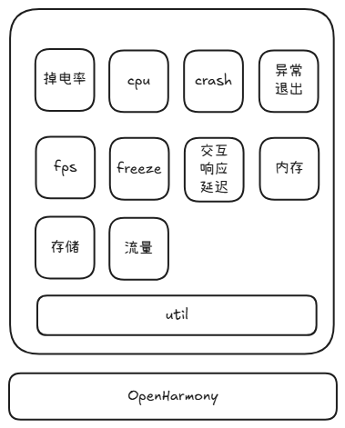

<div align="center">
<h1>hm-metricx-cj</h1>
</div>

<p align="center">


</p>

## 介绍

`hm-metricx-cj` 是一款适用于鸿蒙应用的线上性能监控框架。

`hm-metricx-cj` 系统性地采集和分析监控指标数据，帮助开发团队及时发现性能瓶颈和异常，持续优化应用质量，提升用户体验。

> **注意：**
>
>`hm-metricx-cj`当前处于实验阶段，暂不建议使用，否则可能出现未知问题。

## DevEco Setup
- 需要对应版本的stdx，在系统环境变量里设置加入变量名“CANGJIE_OHOS_STDX_PATH”，变量值是所对应的stdx-path：~\linux_ohos_aarch64_llvm\dynamic\stdx
- 需要DevEco对应的sdk plugins, 在DevEco中File -> Setting -> Plugings: 点击installed右边的按键， 然后选择“Install Plugin From Disk...”把plugins的zip file直接导入。


- Clone文件到本地
```bat
git clone https://gitcode.com/Cangjie-TPC/hm-metricx-cj.git
```
然后导入自己本地的签名，在file -> project structure -> signing Configs: ☑️勾选Automatically generate signature，然后apply再点ok。最后接入手机和对应版本的镜像，点运行就可以验证功能。

## 优势

- 覆盖范围广，支持收集多种量化指标
- 简单便捷，使用无需繁琐的配置
- 轻量高效，可在线上使用

### 特性

1. 支持 crash 事件监控
2. 支持 freeze 事件监控
3. 支持进程异常退出监控
4. 支持 FPS 统计
5. 支持滑动掉帧率统计
6. 支持交互响应延迟统计
7. 支持内存监控
8. 支持 CPU 监控
9. 支持掉电率统计
10. 支持流量统计
11. 支持存储使用统计


## 软件架构



### 源码目录

```shell
─hm_metricx_cj
  └─src
      └─main
          ├─cangjie
          │  ├─battery
          │  ├─cpu
          │  ├─crash
          │  ├─exitInfo
          │  ├─fps
          │  ├─freeze
          │  ├─laggy
          │  ├─memory
          │  ├─storage
          │  ├─traffic
          │  └─util
          ├─cpp
          └─resources

```

- `hm_metricx_cj` 工程模块 - 编译生成一个har包
- `hm_metricx_cj src` 模块代码目录
- `hm_metricx_cj src main` 模块项目目录
- `hm_metricx_cj src main cangjie` 仓颉代码目录
- `hm_metricx_cj src main cpp` cpp代码目录
- `hm_metricx_cj src main resources` 资源文件目录
- `hm_metricx_cj src main cangjie src battery` hm_metricx_cj 掉电率统计目录
- `hm_metricx_cj src main cangjie src cpu` hm_metricx_cj CPU 监控目录
- `hm_metricx_cj src main cangjie src crash` hm_metricx_cj crash 事件监控目录
- `hm_metricx_cj src main cangjie src exitInfo` hm_metricx_cj 进程异常退出监控目录
- `hm_metricx_cj src main cangjie src fps` hm_metricx_cj FPS/滑动掉帧率统计目录
- `hm_metricx_cj src main cangjie src freeze` hm_metricx_cj freeze 事件监控目录
- `hm_metricx_cj src main cangjie src laggy` hm_metricx_cj 交互响应延迟统计目录
- `hm_metricx_cj src main cangjie src memory` hm_metricx_cj 内存监控目录
- `hm_metricx_cj src main cangjie src storage` hm_metricx_cj 存储使用统计目录
- `hm_metricx_cj src main cangjie src traffic` hm_metricx_cj 流量统计目录
- `hm_metricx_cj src main cangjie src util` hm_metricx_cj 工具目录

### 接口说明

主要类和函数接口说明详见 [manual](https://gitcode.com/Cangjie-TPC/hm-metricx-cj/blob/main/docs/manual.md)

## 使用说明

### 集成方式

i.
获取 `hm-metricx-cj` 源码。

ii.
在 `DevEco Studio` 中点击 `Build -> Make module 'hm-metricx-cj'` 编译生成har包 `hm_metricx_cj.har` 。har包产物路径在 `hm_metricx_cj/build/default/outputs/default` 目录下。

iii.
将 `hm_metricx_cj.har` 放到工程模块的har目录下。在工程模块的 `oh-package.json5` 中配置依赖 `"hm_metricx_cj": "file:./har/hm_metricx_cj.har"` 。
并且在工程模块的 `src/main/cangjie/cjpm.toml` 中配置依赖：
```text
[dependencies]
  [dependencies.ohos_app_cangjie_hm_metricx_cj]
    path = "../../../oh_modules/hm_metricx_cj/src/main/cangjie"
```

### 功能示例

以 crash 监控为例：

i.
在主模块的 `main_ability.cj` 的 `onCreate` 回调中调用 `initCrashHandler` ：
```text
class EntryAbility <: UIAbility {
    public override func onCreate(want: Want, launchParam: AbilityConstant.LaunchParam): Unit {
        AppLog.info("Ability OnCreated.${want.abilityName}")
        match (launchParam.launchReason) {
            case AbilityConstant.LaunchReason.START_ABILITY => AppLog.info("START_ABILITY")
            case _ => ()
        }
        initCrashHandler(
            this.context.getApplicationContext(),
            {=> JsonValue.fromStr("{}")},
            {=> unsafe { LibC.mallocCString("{}") }},
            {data => AppLog.error(data.language)},
            Path(this.context.cacheDir),
            OOMHandlerMode.Async,
            1000,
            1000,
            CMemMonitorConfig({soName: String => false}))
    }
}
```

## 约束与限制

当前基于 DevEco Studio 5.1.1.823 和 DevEco Studio Cangjie Plugin Canary 5.1.1.823 版本实现。

1. crash 事件监控限制：
   1. 暂不支持收集存活仓颉线程数/仓颉线程名
2. freeze 事件监控限制：
   1. 暂不支持收集全量仓颉线程调用栈及状态
3. 内存监控限制：
   1. 暂不支持组件级内存泄漏监控
3. 掉电率统计限制：
   1. 暂不支持收集每秒 APP 耗电毫安时
   2. 暂不支持定时统计线程耗电毫安时

## 开源协议

本项目基于 [Apache License 2.0](https://gitcode.com/Cangjie-TPC/hm-metricx-cj/blob/main/LICENSE) ，请自由的享受和参与开源。

## 参与贡献

欢迎给我们提交PR，欢迎给我们提交Issue，欢迎参与任何形式的贡献。
